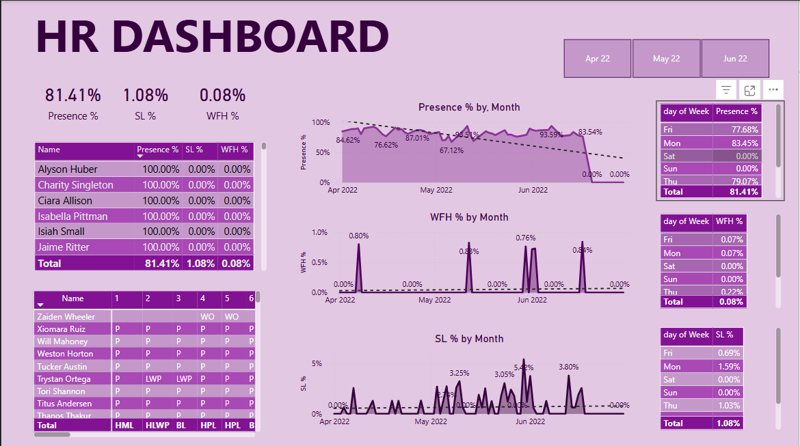

# 🧑‍💼 HR Dashboard – Employee Attendance Insights  A dynamic, interactive Power BI dashboard designed to monitor employee attendance trends including **Presence %, Sick Leave %, and Work From Home %**—supporting HR professionals in making data-driven workforce decisions.  ## 📝 Short Description / Purpose  The HR Dashboard provides a clear and comprehensive view of employee attendance performance over time. It enables HR teams to track presence, WFH, and sick leaves, identify patterns, and enhance employee management strategies using data visualization.  ## 🛠 Tech Stack  The dashboard was built using the following tools and technologies:  • 📊 **Power BI Desktop** – Main data visualization platform used for report creation.  • 🧹 **Power Query** – Data transformation and cleaning for tabular datasets.  • 🧠 **DAX (Data Analysis Expressions)** – Used for calculated metrics like % presence, WFH, and SL.  • 🔗 **Data Modeling** – Integrated HR attendance logs into a cohesive model for time-based analysis.  • 📝 **File Format** – `.pbix` for development and `.png` for dashboard snapshot.  ## 📂 Data Source  Manually recorded or exported employee attendance data from an internal HR system, including: - Daily attendance logs (P, WO, LWP, SL, HPL, etc.) - Monthly summaries of presence, sick leave, and work from home metrics.  ## ✨ Features / Highlights  ### • Business Problem   HR departments often struggle to gain insights from raw attendance data. Identifying absence patterns, peak WFH days, or irregularities in leave usage can be tedious without visual tools.  ### • Goal of the Dashboard   To provide HR professionals and managers with a centralized dashboard that: - Tracks employee presence and absenteeism. - Detects attendance trends by day and month. - Aids in workforce planning, compliance, and performance monitoring.  ### • Walkthrough of Key Visuals   - **Top KPIs (Top Left):**     - Presence %: 81.41%     - Sick Leave %: 1.08%     - WFH %: 0.08%  - **Presence % by Month (Line Chart):**     Monthly trends and regression line highlighting attendance behavior.  - **SL % and WFH % by Month:**     Pinpointing spikes in sick leave or work-from-home to investigate causes.  - **Employee Table:**     Individual employee presence, SL, and WFH metrics for detailed tracking.  - **Weekly Patterns (Table):**     Presence, WFH, and SL analyzed by days of the week to reveal anomalies.  - **Attendance Log Panel:**     Daily status for employees across 6 days, showing attendance codes.  ### • Business Impact & Insights   - **Policy Planning**: Helps HR spot trends for sick leave clustering or WFH spikes.   - **Shift Management**: Supports decisions for shift rotation or workload balancing.   - **Compliance Monitoring**: Detects excessive absenteeism or misuse of leave types.   - **Data-Driven Culture**: Encourages performance improvement through visibility.  ## 📸 Screenshot   <!-- Replace with your actual image path -->
